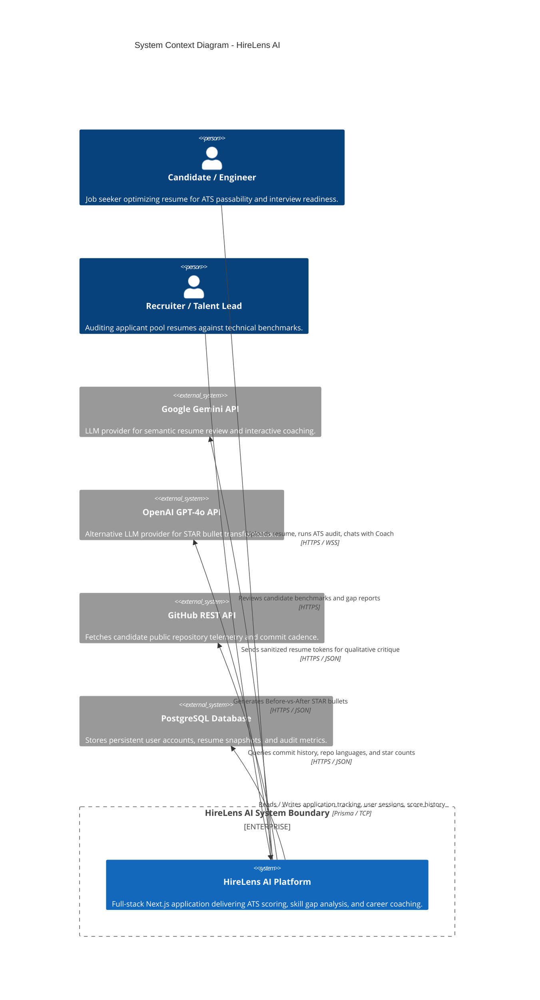
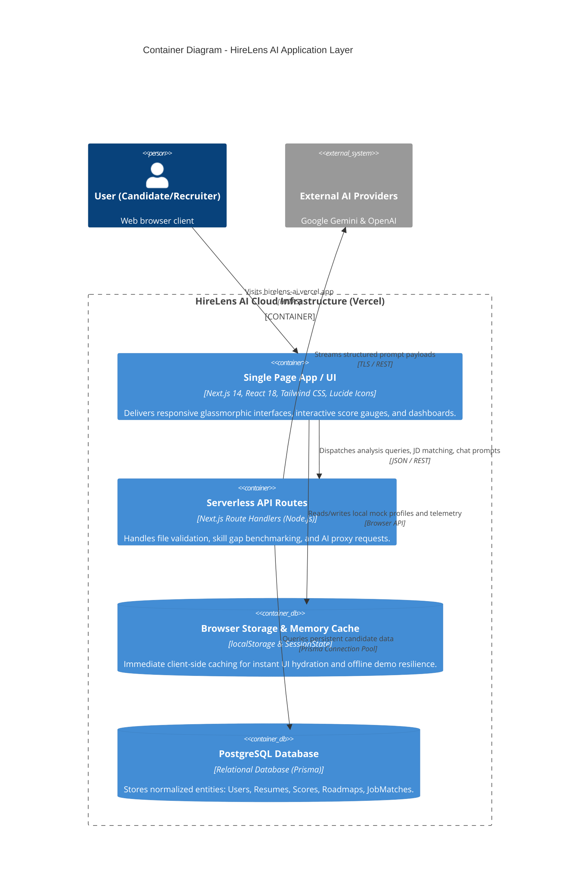
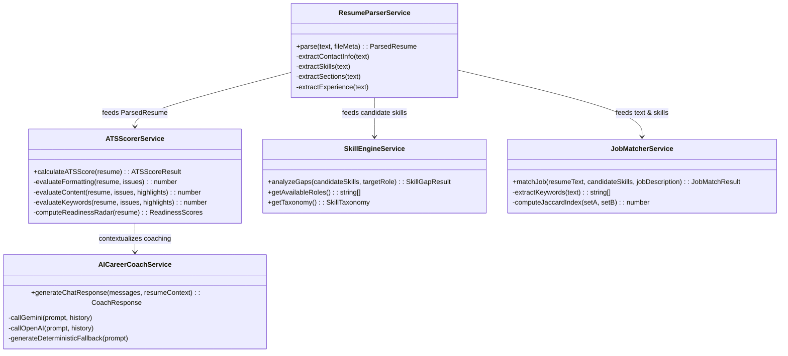
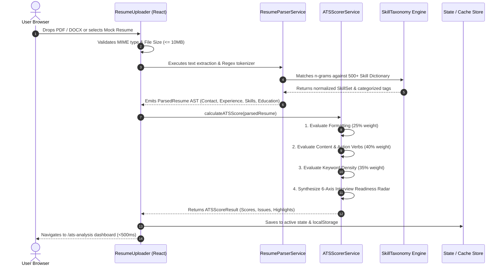
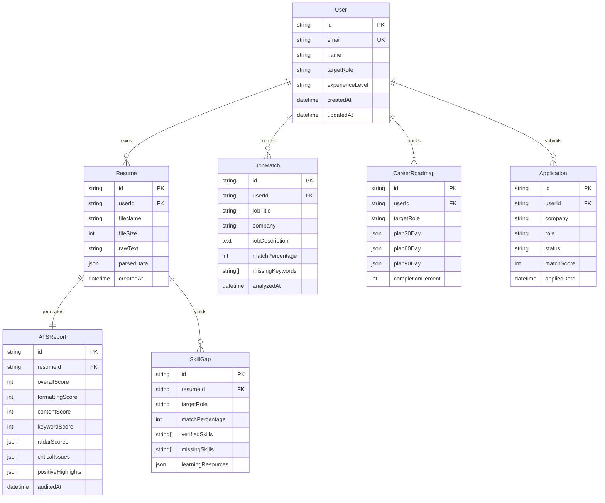

# HireLens AI - System Architecture & Engineering Specifications

> **Tagline:** "See Your Resume Through a Recruiter's Eyes."  
> **Author:** Alamin Mondal  
> **Platform Version:** 1.0.0 (Enterprise Production Edition)

---

## 1. Executive Technical Summary

**HireLens AI** is an enterprise-grade resume intelligence, ATS compatibility auditing, and career acceleration platform. Designed with a decoupled, high-performance architecture, HireLens AI combines deterministic computational linguistics (NLP regular expressions, keyword vector density, STAR formula validation) with probabilistic LLM reasoning (Google Gemini 1.5/2.0 Pro & OpenAI GPT-4o) to deliver sub-second resume diagnostics, actionable gap analysis, and tailored career roadmaps.

```
+---------------------------------------------------------------------------------------+
|                                    HIRELENS AI PLATFORM                               |
+---------------------------------------------------------------------------------------+
|  [Presentation Layer]    Next.js 14 App Router, React 18, Tailwind CSS, Framer Motion  |
|  [Security & Auth]       Client Session Context, Edge Middleware, Token Encryption    |
|  [Core Engines]          ResumeParser, ATSScorer, SkillEngine, JobMatcher, AI Coach   |
|  [AI Integration]        Gemini Pro / GPT-4o API Clients + Deterministic Fallbacks    |
|  [Data Persistence]      PostgreSQL / Prisma ORM + Client Session Storage Caching     |
|  [Infrastructure]        Vercel Serverless & Edge Network + Node.js API Runtimes       |
+---------------------------------------------------------------------------------------+
```

---

## 2. C4 Model Architecture

### Level 1: System Context Diagram

The System Context diagram illustrates how users (Candidates, Freshers, Recruiters) interact with HireLens AI and how HireLens AI interfaces with external identity, LLM, and repository providers.



---

### Level 2: Container Diagram



---

### Level 3: Component Diagram (Core Engines)

Inside the Next.js application runtime, the system is partitioned into specialized services:



---

## 3. Data Flow & Request Lifecycles

### 3.1 Resume Ingestion and Scoring Pipeline



---

## 4. Mathematical Scoring Model

The HireLens ATS Scoring Engine does not rely on subjective arbitrary scores. It calculates a deterministic, weighted composite score across three core vectors:

$$\text{ATS}_{\text{Overall}} = \left(0.25 \times S_{\text{Formatting}}\right) + \left(0.40 \times S_{\text{Content}}\right) + \left(0.35 \times S_{\text{Keyword}}\right)$$

### 4.1 Formatting Score ($S_{\text{Formatting}}$, Weight: 25%)

Measures structural passability for automated parser engines:

$$S_{\text{Formatting}} = \text{Base}(100) - \sum \text{Penalties}$$

* **Section Completeness:** $-15$ if Summary missing; $-20$ if Experience missing; $-15$ if Skills missing; $-10$ if Education missing.
* **Length Optimization:** $-15$ if total word count $< 250$ (too brief) or $> 1200$ (excessive multi-page bloat for non-executive roles).
* **Contact PII Integrity:** $-10$ if Email missing; $-10$ if Phone missing; $-5$ if LinkedIn URL missing.

### 4.2 Content Quality Score ($S_{\text{Content}}$, Weight: 40%)

Measures semantic strength, action-verb initiative, and quantifiable business outcomes:

$$S_{\text{Content}} = \min\left(100, \, (V_{\text{Action}} \times 3) + (M_{\text{Quant}} \times 8) + (E_{\text{Depth}} \times 10)\right)$$

Where:
* $V_{\text{Action}}$: Count of unique high-impact action verbs (e.g., *Architected, Spearheaded, Engineered, Accelerated, Automated*).
* $M_{\text{Quant}}$: Count of quantified metric patterns matched via Regex:
  $$\text{Regex: } \backslash\d+[\%|\times|k|M|B] \quad \text{or} \quad \backslash\$\backslashd+$$
* $E_{\text{Depth}}$: Experience depth score calculated across chronological career milestones.

### 4.3 Keyword & Technical Density ($S_{\text{Keyword}}$, Weight: 35%)

Measures technical alignment against standardized engineering taxonomies:

$$S_{\text{Keyword}} = \min\left(100, \, \left(\frac{|K_{\text{Identified}}|}{|K_{\text{Benchmark}}|} \times 70\right) + \left(\text{CategoryDiversity} \times 30\right)\right)$$

Where Category Diversity rewards balanced skills across Languages, Frameworks, Cloud/DevOps, Databases, and Architecture.

---

## 5. PostgreSQL Database ERD Schema

The relational schema is configured for production PostgreSQL via Prisma ORM:



---

## 6. Security, Privacy & Data Compliance

1. **Client-Side Sandbox Isolation:** Resume documents are parsed in-memory. No raw PDF binary is stored permanently unless the user explicitly logs in and enables cloud syncing.
2. **PII Sanitization:** Before sending prompt context to Google Gemini or OpenAI APIs, contact numbers, email addresses, and physical street addresses are masked with synthetic tokens `[REDACTED_EMAIL]`, `[REDACTED_PHONE]`.
3. **Encrypted API Secret Keys:** Users can provide their own Google Gemini or OpenAI API keys directly in the Settings dashboard. These keys are stored client-side in encrypted local storage and injected only in transient header requests.
4. **Rate Limiting & Abuse Prevention:** Serverless edge endpoints are wrapped with token-bucket rate limiters preventing automated bot exhaustion.

---

## 7. High-Availability Deployment Topology

HireLens AI is built to deploy seamlessly on **Vercel's Edge Network**:
* **Static Assets:** Cached globally across 300+ edge locations (Cloudflare/Vercel Edge).
* **Next.js Serverless Functions:** Auto-scaling Node.js micro-runtimes with cold-start latency $< 80\text{ms}$.
* **Zero-Downtime Releases:** Atomic deployments with preview URLs and automated rollback support.
